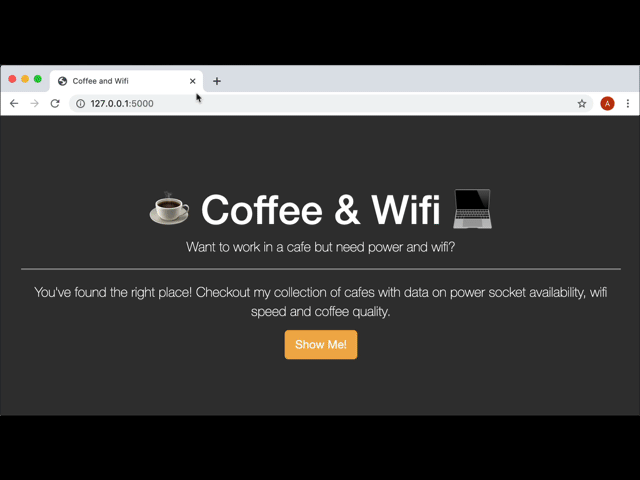
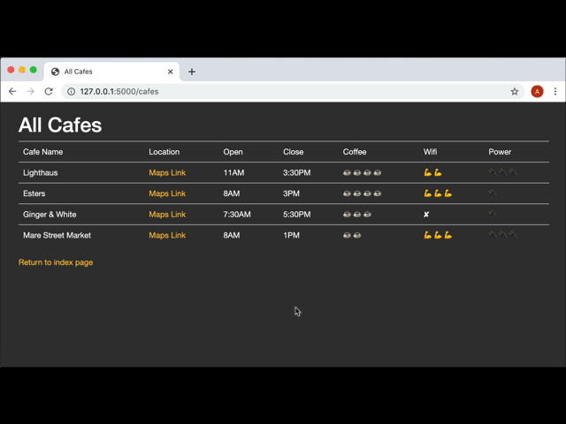
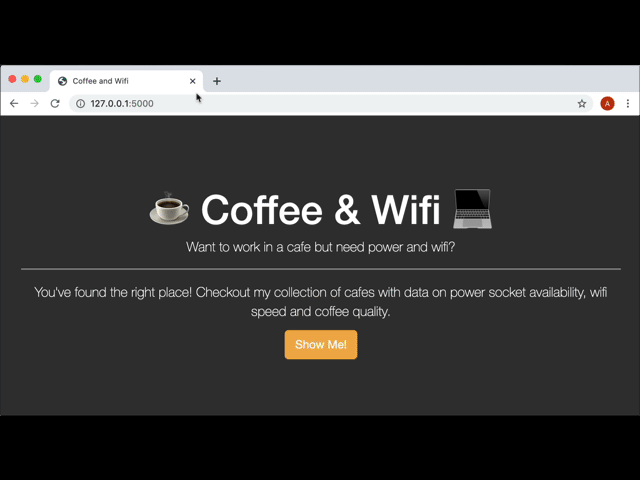
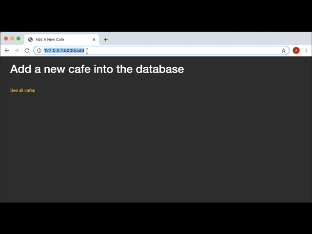
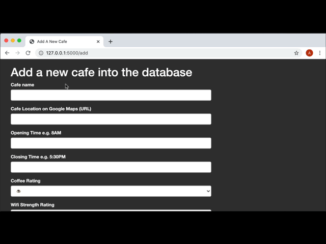
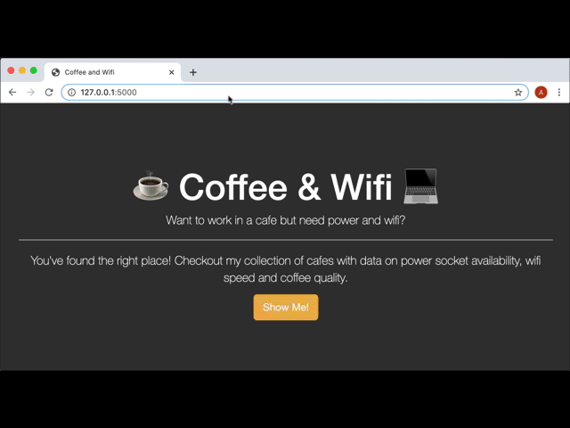
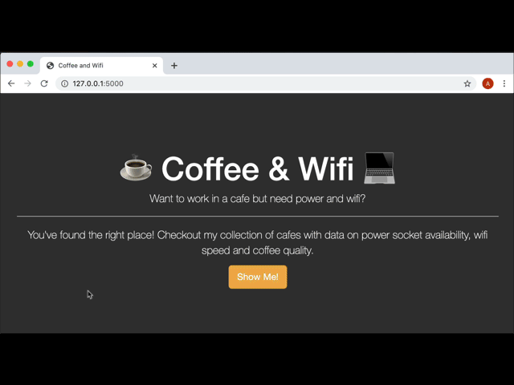

## WTF Form with Jinja 2, CSV File, and Flask
#### This is a website with WTF form, and CSV file management. The project running on : https://replit.com/@ViktoriusSuwand/AppBrewery-Day-62-CSV-WTF-Form-Bootstrap

### Technology and Features :
    * Bootstrap as Front-End CSS Framework
    * python Flask as Back-End Framework
    * Jinja 2 for data transfer with Front-End and Back-End
    * CSV file for data management
    
### Development Key Points
1. The home page should use the css/styles.css file to look like this:
   HINT: Think about bootstrap blocks and super blocks

   

2. The /cafes route should render the cafes.html file. This file should contain a Bootstrap table which displays all the data from the cafe-data.csv
   HINT: A object called cafes is passed to cafes.html from the /cafes route. Try putting it in a 
 to see what the data in cafes look like.

   

3. The location URL should be rendered as an anchor tag <a> in the table instead of the full link.
   It should have the link text "Maps Link" and the href should be the actual link.
   HINT: All location links have the first 4 characters as "http".

   

4. Clicking on the "Show Me!" button on the home page should take you to the cafes.html page.
  
   

5. There should be a secret route "/add" which doesn't have a button, but those in the know should be able to access it and it should take you to the add.html file.
  
   

6. Use what you have learnt about WTForms to create a quick_form in the add.html page that contains all the fields you can see in the demo below:
   HINT: https://flask-wtf.readthedocs.io/en/stable/quickstart.html
   https://pythonhosted.org/Flask-Bootstrap/forms.html

   

7. Make sure that the location URL field has validation that checks the data entered is a valid URL:
   HINT: https://wtforms.readthedocs.io/en/2.3.x/validators/
   How to switch off client-side (browser) validation with quick_forms:
   https://stackoverflow.com/a/61166621/10557313

   

8. When the user successfully submits the form on add.html, make sure the data gets added to the cafe-data.csv. It needs to be appended to the end of the csv file. The data from each field need to be comma-separated like all the other lines of data in cafe-data.csv
   HINT: https://www.w3schools.com/python/python_file_write.asp

  

9. Make sure all the navigation links in the website work.
   
   